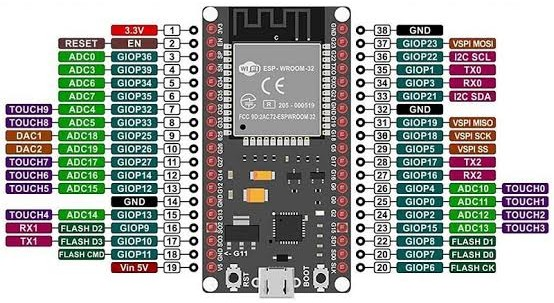
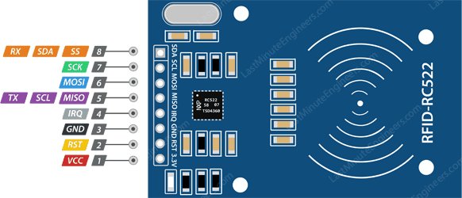
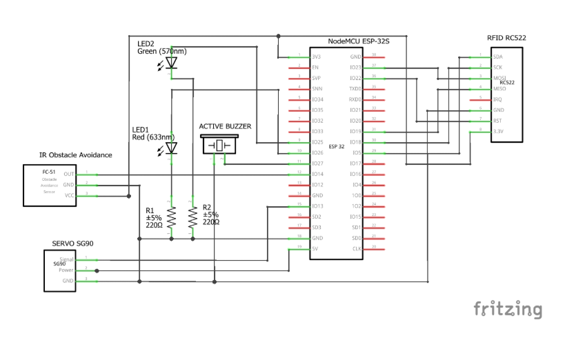
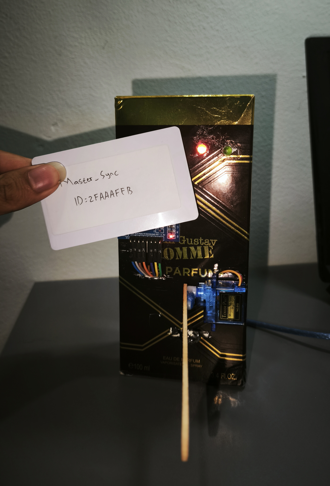
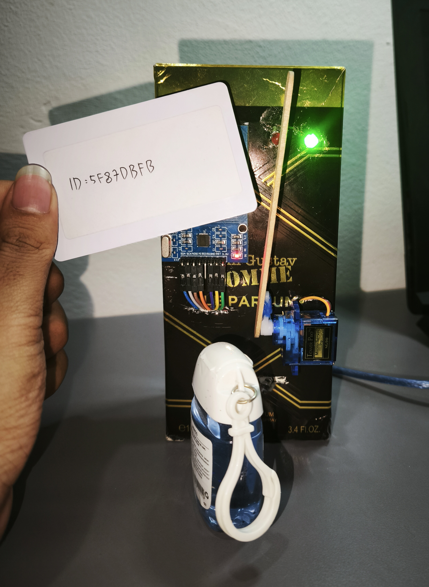
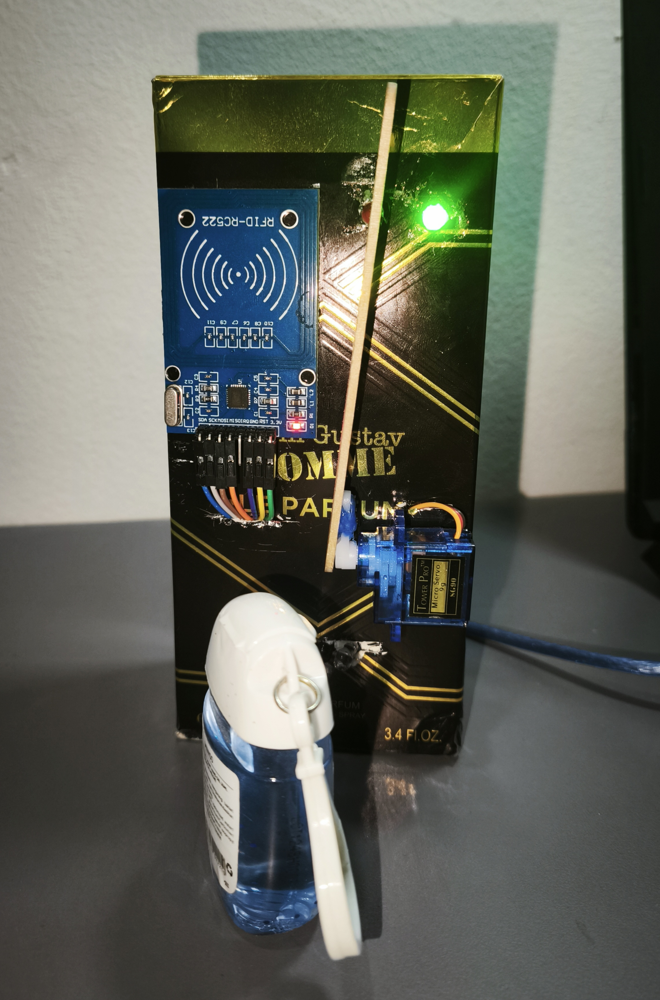
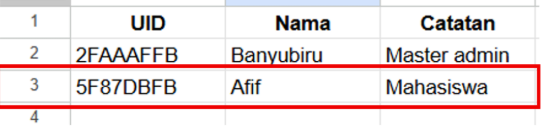

# Housing Entry Barrier System with ESP32-Based RFID Access Control

## Project Domain
This project focuses on a real-time Iot-Based smart housing access control system using RFID RFC522 for identity verification and IR Obstacle Sensors for vehicle safety monitoring, controlled via an ESP32 microcontroller, integrated with a Servo for mechanical actuation and Google Sheets for real-time cloud data logging.

### Problem Statements
- Physical limitations of security guards in monitoring housing 24 hours a day.
- Potential negligence of security guards in allowing unknown person enter the area without inspection.
- Queues of housing residences during rush hour which is time-consuming and inefficient.

### Goals
- Create a prototype for advanced security system that utilizes ESP 32, RFID for validate access, and servo motor as a crossbar driver.
- Implement an efficient algorithm in processing card identity data to minimize vehicle queue.
- Building an IoT integration by utilizing wireless features on ESP 32 to send notifications and log to database.

### Solution Statements
- Use an RFID RC522 reader to scan and verify the Unique Identifier (UID) of access card for resident authorization.
- Implement an IR Obstacle Sensor (FC-51) as a safety mechanism to detect the presence of vehicles and prevent the barrier from closing prematurely.
- Use an ESP32 microcontroller to manage system logic, local data processing, and WiFi-based internet connectivity.
- Control a Servo Motor to perform mechanical actuation of the gate barrier based on validation and safety inputs.
- Integrate with Google Sheets via Google Apps Script for real-time cloud data logging and centralized access monitoring.
- Include a Buzzer and LED indicators to provide immediate auditory and visual feedback on the access status.

## Prequisites

### Component Preparation

- **ESP32**: Microcontroller for data processing and servo control.
- **RFID RC522 Module**: Reader component for emitting radio waves to read the unique identifier (UID) data from the RFID card.
- **RFID Card**: Passive card that stores identity data in the form of a Unique Identifier (UID) and is used by users to verify their access authority to the system.
- **Servo Motor SG90**: Converts the control signal (PWM) from the ESP32 into a rotational movement from 0° to 90° in order to open and close the gate.
- **IR Obstacle Sensor FC-51**: Ddtect the presence of vehicles in the gate area.
- **5V Active Buzzer**: Provides auditory feedback in the form of a beep sound.
- **LED (Red and Green)**: Visual indicator lights showing the access status.
- **220Ω Resistor**: Used as a current limiter in the LED circuit to prevent damage caused by excessive current.
- **Jumper Wires (Male-to-Male & Female-to-Female)**: Used to connect data and power lines between components in the circuit.
- **Breadboard & Expansion Board**: Prototype boards used to facilitate wiring between the microcontroller pins and sensors.
- **Micro USB Cable**: To supply power from an electrical source to the ESP32 and to upload programs from a computer.

### Datasheet ESP32 (NodeMCU ESP-32S)

  

### Datasheet RFID RC522

  

### Schematic Diagram

  

## Demo Results

To evaluate the system's performance, several test scenarios were conducted to ensure the RFID validation, gate mechanism, and safety features work as expected

### 1. Unauthorized Access Denial
When an unregistered RFID card is tapped on the reader, the system denies access. The red LED remains on, the buzzer sounds an error beep, and the gate remains closed.

  

### 2. Cloud-to-Local Database Synchronization
By tapping a pre-configured MASTER Card, the ESP32 connects to the internet to fetch the latest authorized UID list from the Google Sheets database and synchronizes it into the local memory.

  

### 3. Authorized Access Granted
When a registered RFID card is tapped, the system grants access. The green LED turns on, the buzzer plays a success beep, and the servo motor automatically opens the gate.

  

### 4. Safety Mechanism (IR Obstacle Sensor)
While the gate is open, the IR Obstacle sensor continuously monitors the area underneath. 
- **Detecting Object:** If a vehicle is detected (sensor outputs `LOW`), the gate remains open to prevent the gate from hitting the vehicle.
- **Area Clear:** Once the vehicle passes and the sensor no longer detects an object (outputs `HIGH`), the gate automatically closes after a short delay.

  

## System Evaluation & Data Logging
The system's reliability and IoT integration were evaluated through real-time data logging:
- **Serial Monitor Output:** Displays real-time UID reading formats and local validation status during hardware operation.
- **Google Sheets Integration:** Every access attempt is automatically logged to a cloud database via Google Apps Script. The log successfully records the `Timestamp`, `UID`, and `Status`.
- **Log Status Categories:** The system successfully categorizes events into `ALLOW_LOCAL` (access granted), `DENY_LOCAL` (access denied), and `MASTER_SYNC` (database updated).

  

## Conclusion
This project demonstrates a modern, responsive, and efficient system for automating residential gate access using an ESP32, an RFID reader, and an IR obstacle sensor. The integration of a hybrid database architecture solves internet dependency issues by allowing instantaneous local UID validation, while seamlessly logging access data and synchronizing with Google Sheets when connected to the cloud. Furthermore, the implementation of the IR sensor as a safety mechanism effectively prevents the gate from closing prematurely on vehicles, significantly enhancing overall system reliability and user safety. This system provides a solid foundation that can be further enhanced with a real-time web monitoring dashboard, larger external local storage (microSD), or camera integration for advanced multi-factor authentication.

## Members
- Muhammad Ershad Hanif Radhiyya
- Afif Rafi Ardiyanto
- Muhammad Banyubiru Faiq
